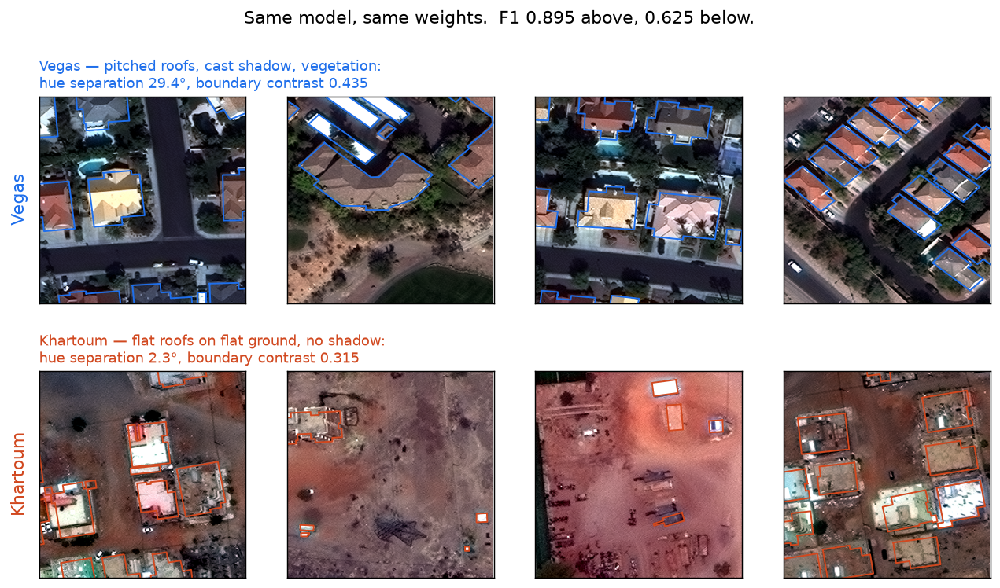
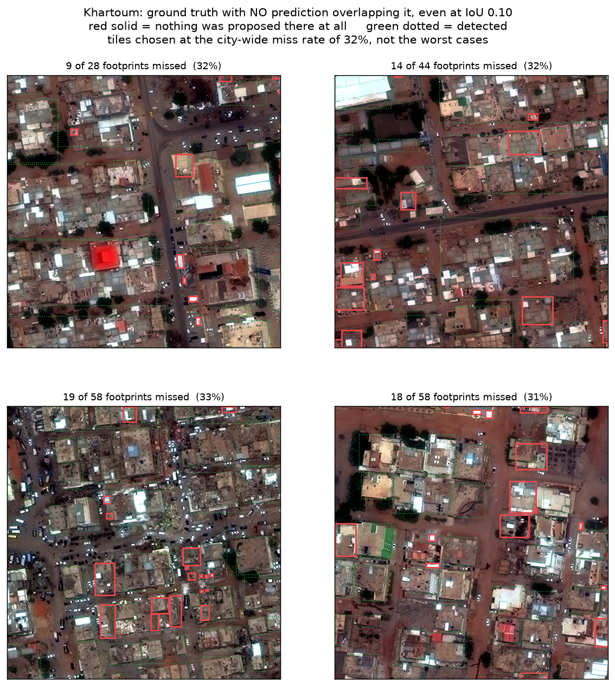
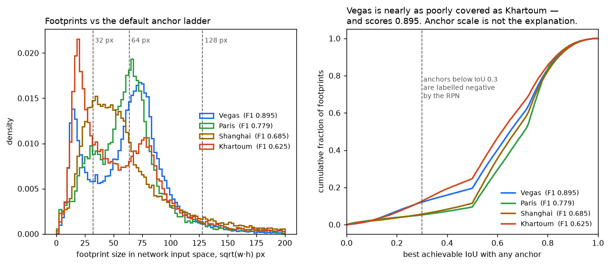

# Hue predicts which cities are hard. It isn't why.

*A building-detection baseline on SpaceNet 2, and a 42.7% explanation that ablated to nothing.*

---

## The setting

SpaceNet 2 asks a detector to find building footprints in satellite imagery across four cities: Las Vegas, Paris, Shanghai and Khartoum. It is a 2017 benchmark with published results, which makes it a good place to establish whether a pipeline works before trusting it on anything harder.

I trained Mask R-CNN with a ResNet-50 FPN backbone on all four cities pooled — 8,474 training tiles, 2,118 validation tiles, 218,681 building footprints — using detectron2 in a pinned Docker image. Three seeds, everything else held fixed.

| | macro F1 | Vegas | Paris | Shanghai | Khartoum |
|---|---|---|---|---|---|
| **this work** (3 seeds) | **0.7459 ± 0.0012** | 0.8948 | 0.7787 | 0.6848 | 0.6254 |
| XD_XD, 2017 winner | 0.6930 | 0.885 | 0.745 | 0.597 | 0.544 |
| YOLT baseline | 0.6000 | | | | |
| modified MNC baseline | 0.5700 | | | | |

**This is not a claim of beating the 2017 winner**, and the reasons matter more than the number. XD_XD was scored on the competition's withheld test set. Those labels were never released, so nobody outside the original scoring can evaluate on them. My figures come from a validation split carved out of the training data — easier ground, drawn from the same acquisitions. Two further asymmetries push the same direction: a random tile split is spatially autocorrelated, and my IoU is computed on rasterised masks rather than the georeferenced polygons the original metric used.

What *is* meaningful is that the difficulty ordering reproduces the published one exactly — Vegas ≫ Paris > Shanghai > Khartoum — from a completely different architecture. Getting a plausible score by accident is easy. Reproducing the *structure* by accident is much harder, and that is the signal worth trusting.

Every score here uses one score threshold, 0.544, selected on the **training** split and never on the data being reported. Tuning a threshold per city on the scored set gives 0.7462 instead — better, and not a result.

## The puzzle

One model, one set of weights, four cities, and a spread from 0.895 to 0.625.

Three seeds put the noise floor at ±0.001 per city, so a gap of 0.27 is roughly two hundred standard deviations. Whatever separates Vegas from Khartoum is structural, and it is in the data rather than in the training run.

*Four validation tiles from each city, same model, same weights. Vegas above: terracotta roofs against green vegetation and cyan pools, pitched surfaces throwing shadow. Khartoum below: flat roofs on flat ground, in the same dust colour as the ground.*

The SpaceNet dataset paper explains Khartoum in a single unmeasured sentence: *"low contrast between building and background."* That sentence turns out to have three possible readings, and they do not agree with each other.

## What it isn't

**Not building size.** Khartoum is 47.7% small instances against Vegas's 29.0%, and small objects score worse everywhere, so composition alone could in principle produce the whole ordering. Scoring *within* each size bucket kills that: the city ordering survives inside every bucket, and Vegas's medium buildings score 0.980 against Khartoum's 0.760 — a 0.22 gap between objects of the same size class. Re-weighting each city to Vegas's size mix closes **18%** of the gap. Real, and minor.

**Not crowding.** Footprints that abut share a boundary, so even a detected building might not clear IoU 0.5. Measured across all four cities, abutment is essentially zero everywhere.

**Not brightness contrast** — and this is where the published explanation fails on its natural reading. Khartoum has the **highest** roof-versus-ground brightness separation of the four cities: Cohen's *d* of 1.575, against Vegas at 1.136. Its buildings stand out from the ground *more* than anyone else's.

What Khartoum does have is a soft *edge*. Boundary contrast, measured across a two-pixel ring either side of each footprint, is 0.315 against Vegas's 0.435. Roofs differ from the ground on average while the transition between them is gradual. Detection lives on edges, not on means, and the two measurements separate exactly there. Either statistic alone would have misled.

## The hue hypothesis

Looking at the tiles, the thing that struck me was colour. Khartoum's roofs and its terrain look like the same material. Everything measured so far had been brightness; hue is a genuinely separate axis.

It is also a fiddly one. Hue is **circular** — 359° and 1° are two degrees apart, not 358 — so every mean here is computed as `atan2(mean sin, mean cos)` and every distance wraps. A linear average over hue angles puts the mean of red pixels somewhere in the cyans. Hue is also **undefined at low saturation**, which is exactly the regime bare desert and concrete roofs occupy, so saturation is reported beside every number and near-neutral pixels are excluded from the vote.

One more detail that turns out to decide the result. OpenCV's 8-bit HSV quantises hue to **2° per step**. Measured properly, in float:

| city | F1 | roof hue | ground hue | separation | saturation (roof) |
|---|---|---|---|---|---|
| Vegas | 0.895 | 109.7° | 139.1° | **29.4°** | 0.316 |
| Paris | 0.779 | 132.6° | 156.3° | **23.8°** | 0.257 |
| Shanghai | 0.688 | 136.9° | 141.9° | 5.0° | 0.316 |
| **Khartoum** | 0.627 | 81.6° | 83.9° | **2.3°** | 0.326 |

Khartoum's roofs and terrain are **2.3° apart** against Vegas's 29.4° — a factor of thirteen. Khartoum's entire separation is **one quantisation step** in 8-bit HSV. Measured at 8-bit precision this finding does not exist: it reads as zero for Khartoum and as noise for Shanghai.

And it is not a low-saturation artefact, which was the obvious way this measurement could have lied. Khartoum has the *highest* roof saturation of the four, comfortably above the noise floor. There is real colour there. It is the same colour on both sides of the wall.

Note the dissociation: Khartoum leads on brightness separation and comes last on hue separation. Those two come apart, and the one that ordered with F1 was hue.

## An asymmetry in the imagery itself

Before attributing anything to the scenes, it is worth asking whether the four cities were even imaged on equal terms. Two candidates matter in dense low-rise scenes: off-nadir look angle, which shears facades across footprints, and ground sample distance.

**Off-nadir cannot be checked from the data as distributed.** The delivered rasters carry no acquisition geometry at all — no nadir angle, no azimuth, no sun elevation, no collect date. That is a real gap in this analysis rather than a finding, and I would rather name it than imply the question was settled. SpaceNet 4 exists precisely because off-nadir is its own problem; for SpaceNet 2 the collect angles are simply not in the distribution.

**Resolution, though, is measurably not controlled.** Every tile is 2.7×10⁻⁶ degrees per pixel in *both* axes — square in degrees, not in ground metres. Because a degree of longitude shortens with latitude, the ground sample distance follows:

| city | GSD, east–west | GSD, north–south | latitude | F1 |
|---|---|---|---|---|
| Paris | **0.197 m** | 0.298 m | 49.0 | 0.779 |
| Vegas | 0.243 m | 0.298 m | 36.2 | 0.895 |
| Shanghai | 0.256 m | 0.298 m | 31.4 | 0.685 |
| **Khartoum** | **0.290 m** | 0.298 m | 15.6 | 0.625 |

A 47% spread in effective resolution across the benchmark, and pixels that are non-square on the ground — in Paris by a factor of 1.51, so footprints are geometrically stretched relative to their true shape.

Khartoum is the coarsest. A building of a given physical width spans about a third fewer pixels there than in Paris, and Khartoum's buildings are already the small ones. That compounds. It does not by itself explain the ordering — Paris has the finest resolution and only the second-best score — but any account of why Khartoum is hard has to carry it.

## Apportioning it

Correlating four factors against four cities is not analysis. Four data points, four correlated predictors, zero residual degrees of freedom — any coefficients fit perfectly and none of them mean anything.

But the constraint is an artefact of aggregating. Those four cities are 1,696 usable validation tiles carrying 43,478 instances, each with its own hue separation, boundary contrast, shadow signature, building sizes and measured recall. At tile level the same question has thousands of observations. Weighted least squares, weighted by ground-truth count so the fit is an instance-level statement rather than a tile-level one:

| factor | share of the Vegas–Khartoum gap it explains alone |
|---|---|
| **hue separation** | **42.7%** |
| shadow | 35.6% |
| building size | 26.1% |
| boundary contrast | 12.7% |
| density | none |

Those sum past 100 because the factors overlap — Vegas has more of all of them at once. Fitted jointly they explain 55.7%, leaving 44.3% of the gap unexplained. Variance inflation factors all came in under 1.5, so the individual coefficients were stable rather than mush.

Hue came out the largest single contributor. At which point the honest move is to stop being pleased and go test it.

## The ablation

Correlation on observational data cannot distinguish a cue the model uses from a correlate that merely travels alongside one. Vegas has more of every favourable property simultaneously, so association is exactly what this analysis would show whether hue mattered or not.

So: remove colour, retrain, and see what happens.

The ablation collapses chroma to greyscale **after** the stretch and replicates the single channel three times. Replicating rather than feeding one channel keeps the architecture, the input shape and the COCO-pretrained stem byte-identical, so the presence of colour is the only variable. A single-channel input would change the first convolution as well and confound the two.

The interpretation of every possible outcome was written down *before the run finished*, so it could not be reasoned backwards afterwards. If hue were causal, the cities that have it — Vegas at 29.4°, Paris at 23.8° — should lose most, while Khartoum at 2.3° has almost nothing to lose, and the gap should close by something like the predicted 42.7%.

| AOI | colour | greyscale | Δ |
|---|---|---|---|
| Vegas | 0.8947 | 0.893 | −0.002 |
| Paris | 0.7773 | 0.777 | −0.000 |
| Shanghai | 0.6862 | 0.678 | −0.008 |
| Khartoum | 0.6267 | 0.626 | −0.001 |
| pooled F1 | 0.7935 | 0.7895 | −0.004 |
| **Vegas−Khartoum gap** | **0.2680** | **0.2670** | **−0.001** |

**The gap did not move.** Predicted to close by 42.7%; closed by 0.4%. The model retains **99.5% of its performance with no colour at all.**

## What was actually going on

Both things are true at once, and the reconciliation is the finding: **hue separation genuinely predicts difficulty, and the detector genuinely does not use it.**

Hue separation is a proxy for scene complexity rather than a cue. Vegas has vegetation, swimming pools, pitched roofs and cast shadows. Those produce chromatic variety *and* the structural cues the network actually keys on. The correlation runs entirely through the confound.

There is a further consequence that closes off a line I had been considering. A method that gates on hue needs its target class to be **chromatically defined** — a known centroid to test against. Buildings have none: Khartoum's roofs sit at 81.6°, Vegas's at 109.7°, Paris's at 132.6°. There is no building hue. *Separation from background is not the same property as chromatic definition*, and this run is the empirical demonstration that the first without the second buys nothing.

## Where Khartoum's difficulty actually lives — still unresolved

Loosening the IoU requirement separates two failures that recall at 0.5 cannot distinguish: a building nothing was proposed on, versus a building found but outlined too loosely.

At **IoU 0.10** — barely more than asking whether anything was placed roughly in the right spot — Khartoum still misses **32% of its buildings**, against Vegas at 12%. Those are not loose outlines. Nothing was proposed on them at all. And Khartoum's recovery between IoU 0.5 and 0.25 is unremarkable: 18.3%, *less* than Paris at 25.1%.

*Ground truth with no prediction overlapping it even at IoU 0.10. Red solid: nothing was proposed there at all. Green dotted: detected. These tiles were chosen at the city-wide miss rate of 32%, not from the worst cases — the extreme tail runs past 65% and would misrepresent the result.*

So the mask head is not the bottleneck, and raising mask resolution would not help. The failure is upstream, in whatever produces objectness.

The obvious next suspect was anchor scale. Khartoum's median footprint is 1,182 px against Vegas's 2,327, and the FPN anchor set is the COCO default — sizes 32 through 512, aspect ratios 0.5, 1 and 2, never examined against this data. A proposal stage that cannot generate a box at the right scale would produce exactly this signature.

It is cheap to test, so I tested it. One detail decides the answer: the comparison has to be made in **network input space**, not tile space. Tiles are 650 px native and `MIN_SIZE_TEST` is 800, so every box is scaled by 1.231 before an anchor ever sees it. Comparing raw tile pixels against anchor sizes would understate coverage by 23% and manufacture the finding.

| city | median box (network px) | no anchor reaches IoU 0.3 | smaller than the 32 px anchor | F1 |
|---|---|---|---|---|
| Vegas | 65.3 | **12.0%** | 22.0% | 0.895 |
| Paris | 62.3 | 5.3% | 16.6% | 0.779 |
| Shanghai | 52.7 | 5.6% | 21.7% | 0.685 |
| Khartoum | 50.7 | **12.6%** | 33.9% | 0.625 |

Khartoum is the worst covered — and **Vegas is effectively tied with it** on the measure that matters, 12.0% against 12.6%, while scoring 0.895. Being poorly represented by the anchor set is demonstrably survivable. Khartoum does have far more footprints below the smallest anchor, 33.9% against Vegas's 22.0%, and that is worth carrying forward. But it is not a sufficient explanation, because the easiest city in the benchmark has nearly the same problem and does not suffer from it.

**So: contrast is ruled out on both the luminance and chromatic axes. Composition accounts for 18%. Crowding is absent. Anchor scale is a real difference and not a sufficient cause. A third of Khartoum's buildings are missed for a reason I have not identified.**

That is the fourth plausible mechanism in this project to fail on contact with a test. The honest position is an open question with four candidates eliminated, which is worth more than a fifth guess.

## What carries forward

**Precision is not a detail.** The entire hue result lives inside one 8-bit quantisation step. Measured at the default precision, it is invisible.

**Attribution analysis cannot establish mechanism.** A weighted least-squares fit with clean collinearity diagnostics produced a confident 42.7% that an ablation reduced to zero. Stability is not causality, and the diagnostics looking good is not evidence that the thing is a cause.

**A control group is what turns a measurement into a finding.** Khartoum's anchor coverage looks damning until Vegas is put beside it with nearly the same number and four times less trouble. Every difference in this analysis that survived was one where the comparison city behaved differently too.

**Register the interpretation before the result.** Writing down what each outcome would mean, before the run finishes, is the cheapest available protection against reasoning backwards from whatever arrives.

**Two hours beats a semester.** The strongest reason to run the ablation was not this paper. It was that a chromatic loss function was on my roadmap, and a network extracting nothing from colour gives such a loss nothing to weight. One afternoon established that this dataset is the wrong testbed for that method — before it became a semester.

A negative result that closes a door is worth more than a positive one that opens a door onto nothing.

---

## Reproducing this

Everything is public.

- **Code and full lab notebook:** [github.com/benjbritton/spacenet2-detectron2](https://github.com/benjbritton/spacenet2-detectron2)
- **Experiment tracking:** [wandb.ai/benjbritton-geoai/benjbritton_FA26](https://wandb.ai/benjbritton-geoai/benjbritton_FA26)

`REPRODUCE.md` carries every number above with the literal command that produced it, the image digest, and the resolved package list. `LAB_NOTEBOOK.md` is the running record, including the three earlier claims in this project that died under the same kind of scrutiny the hue finding did — and the one where my own correction had to be corrected.

Training is not bit-exact even at a fixed seed: nondeterministic CUDA accumulation plus fp16 loss scaling. Seeds buy comparable runs, not identical ones, and the notebook records what that costs.

*Work carried out on an RTX A5000 as part of an independent study in the Department of Geography & GIS, University of Cincinnati.*
