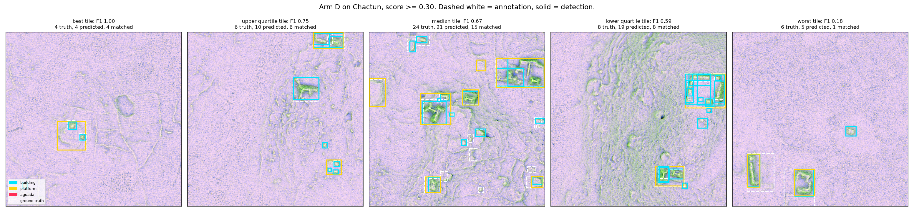
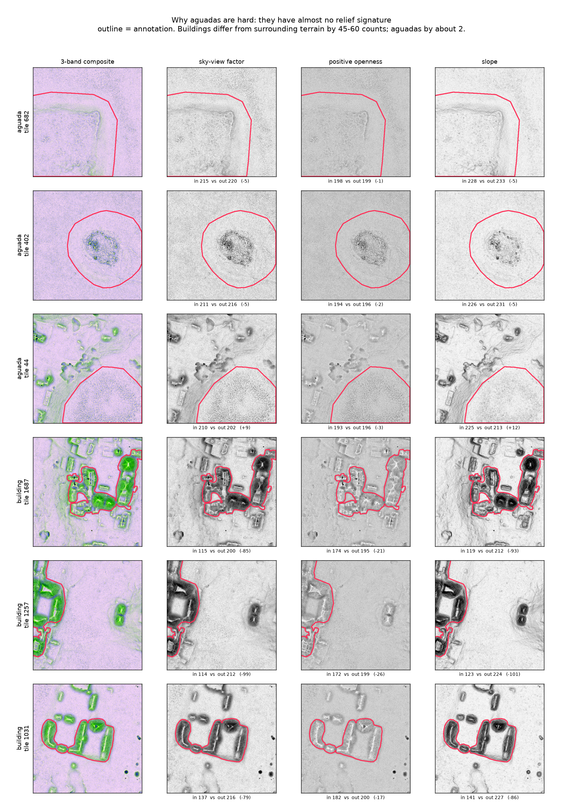
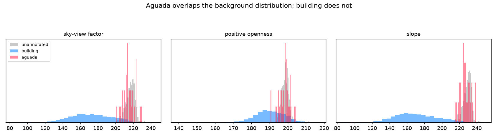
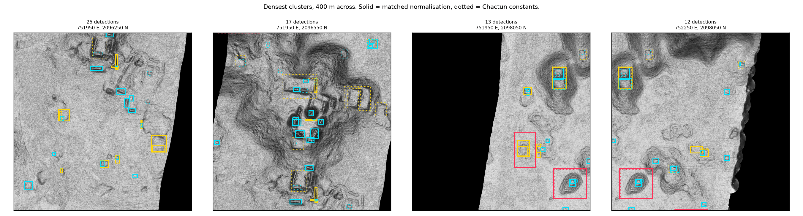

# A multiclass model of Chactún, Mexico: Pipeline design, external evaluation, and lessons learned
*Building a three-class detector for ancient Maya structures on Chactún, testing six mechanisms across 36 training runs, then taking it to a different LiDAR survey to find out what portability actually requires.*
---
Milestone C of this independent study asked for experience building a multiclass object detector from a provided dataset. The dataset was Chactún — 2,094 tiles of airborne laser scanning over central Yucatán, annotated for three classes of ancient Maya feature. The work divides cleanly in two.
The first half is what was assigned: build the detector, then find out what makes it better. The result recovers 92% of annotated structures at a survey-appropriate operating point. Six candidate improvements were tested against it, and the one that worked was a change to the data pipeline rather than to the model — it cost no extra compute and improved every class. The four model-side changes, including the two with the strongest prior arguments, produced nothing measurable.
The second half was not assigned and produced the more transferable lesson. The trained detector was handed a completely different LiDAR survey and asked to be useful on it. It was not, and the reason had nothing to do with the architecture, the training or the tuning — it lay in what the source dataset does and does not make available. That failure is what identifies the requirements a portable tool would have to meet, and those requirements are the most useful thing this milestone produced.
---
## The dataset, and three ways to ruin it before training starts
Chactún (Somrak, Džeroski & Kokalj, *Scientific Data* 2023, CC BY 4.0) ships 480×480 tiles at 0.5 m, three bands — sky-view factor, positive openness, slope — with annotations as **semantic masks**, one binary raster per class per tile.
Converting semantic masks into instance annotations is where the damage happens, and three specific things will do it quietly.
**The masks are inverted.** Object pixels are 0; background is 255. Reading them the obvious way, mask > 0, produces one tile-sized "instance" per class per tile. Training proceeds, the loss decreases, and the model learns nothing. This was caught only because the output was absurd — nothing raised an error.
**Semantic masks are not instance masks.** Adjacent structures that touch fuse into one connected component. Plain connected components recover 7,442 buildings against 9,303 published — a 20% undercount, entirely from merging. A distance-transform watershed was tried to separate them and does not work at any setting:
| | | | |
|-|-|-|-|
| **mode**|**buildings**|**vs components**|**median footprint** |
| connected components | 1,679 | — | 157 m² |
| watershed d=8 | 2,345 | ×1.40 | 114 m² |
| watershed d=12 | 1,242 | ×0.74 | 193 m² |
| watershed d=16 | 1,279 | ×0.76 | 157 m² |
| watershed d=22 | 1,586 | ×0.94 | 156 m² |
| watershed d=30 | 1,678 | ×1.00 | 157 m² |

Recovering the merges needs roughly ×1.25 *with the footprint intact*. Small radii over-split single structures and halve their size; large radii lose components to peak suppression and converge back to plain components. The undercount stands, documented rather than hidden.
**Tile boundaries cut structures.** 3,429 of 9,853 instances touch an edge. Platforms therefore *over*count — 2,335 against 2,110 — in the same conversion where buildings undercount. Opposite errors on different classes, because platforms are large enough to cross tiles while buildings are small enough to fuse with neighbours. Edge instances are kept, since a half-visible structure is a real detection target, and every annotation carries a flag so an evaluation can exclude them without reconverting.
---
## No spatially blocked split is possible, and that is a finding
Milestone B established spatially blocked splits as the honest way to hold out geographic data. Chactún cannot take one. The rasters carry no CRS and no affine transform, and the layout is not recoverable from the pixels either.
**The numbering carries no layout.** Edge correlation across all 2,093 consecutive-ID pairs is 0.291, against a random-pair baseline of 0.291. A sweep of every candidate row width from 2 to 259 is flat at ~0.283, with no spike anywhere.
**No seams exist at all.** An all-pairs search over 4.38 million ordered pairs, both axes, finds zero pairs that are both reciprocal and z > 8. Best-match z-scores top out at 6.2 and reciprocal matches occur for 4–6% of tiles, which is chance.
That negative could have been manufactured by per-tile contrast stretching, which would hide a real seam — so that was ruled out separately. Only 34% of tiles are pinned to exactly 0–255 across all bands, and per-tile ranges vary with the terrain, so a shared seam would have survived. The tiles genuinely are not neighbours.
This is almost certainly deliberate. Publishing precise coordinates for thousands of undocumented Maya structures is a looting risk, and withholding georeferencing is normal practice for unexcavated sites. It is not an oversight to be worked around.
The substitute blocks on **appearance**— cluster the tiles, assign whole clusters to one side — and it barely works. Against a random control it moves cross-split similarity from 0.743 to 0.761 (the wrong way), p95 from 0.915 to 0.907, max from 0.978 to 0.954. Only the tail improves. Chactún tiles are homogeneous enough that every validation tile has a near-twin in training under any partition. **Validation scores on this dataset are optimistic however it is cut**, and that belongs in the results rather than a footnote.
---
## The experiment
Five cluster-blocked folds, chosen over a single held-out split for a specific reason: aguada has 76 instances in the entire dataset, so one split evaluates about fifteen of them, which is not a measurement. Across five folds every instance is evaluated exactly once.
Six arms, each differing from its neighbour by one thing:
| | |
|-|-|
| **arm**|**change** |
| A | Mask R-CNN R50-FPN, stock anchors — the control |
| B | anchor ladder shifted down one octave |
| C | Cascade Mask R-CNN head |
| D | full D4 augmentation — flips plus 90° rotations |
| E | repeat-factor oversampling of rare-class tiles |
| F | 960 px input, double the native resolution |

Comparisons are **paired by fold**, because folds differ from each other far more than arms differ from each other — arm A alone spans 36.30 to 42.61 across folds. Every arm ran the same five folds, so the difference is taken per fold and tested on those differences, which removes fold difficulty entirely.
The seed noise floor was measured rather than assumed: fold 0 was run at three seeds per arm for arms A, B and C, giving 0.80–1.39 sd on segmentation AP.
Two predictions were written into the configs *before* the runs, so they could not be reasoned backwards afterwards.
---
## What moved, and what didn't
| | | | |
|-|-|-|-|
| **arm**|**segm AP**|**vs control**|**verdict** |
| **D — D4 augmentation**|**42.87 ± 2.80**|**+4.16** | real, survives correction |
| F — 960 px input | 38.81 ± 2.77 | +0.10 | null |
| A — control | 38.71 ± 2.45 | — | — |
| C — cascade head | 38.58 ± 2.71 | −0.13 | null |
| E — repeat sampling | 38.65 ± 2.31 | −0.06 | null |
| B — shifted anchors | 37.91 ± 2.67 | −0.80 | null |

**Anchor scale is falsified.** At the 800 px input these configs use, 31.8% of buildings fall below the smallest 32 px anchor — an obvious-looking problem with an obvious-looking fix. Shifting the ladder down an octave gave −0.80 ± 1.07, below the seed noise floor, with *every* metric negative. This is the fifth mechanism in this project to survive attribution analysis and then die under ablation.
**Cascade confirmed a predicted pattern at an irrelevant magnitude.** The prediction on record was AP50 within noise, AP75 favouring cascade, AP(0.5:0.95) favouring it partly spuriously. Observed: AP50 −0.36, AP75 +2.23, segm AP +0.68. The pattern held; nothing reached significance; it costs 27% more compute per run.
**Resolution is falsified too, and in the wrong direction.** Arm B ruled out giving small objects *anchors*; arm F tested giving them  *features*, which is a different mechanism — at stride 4, a 25 px building covers about 6 feature cells natively and about 12 at double scale. Two competing predictions were recorded in the config beforehand, +1.5 to +3.0 against +0 to +1.5. The result was **+0.10**, and small-object AP went *down* by 0.71. Both predictions agreed that a genuine resolution effect had to appear in AP75 and small-object AP rather than AP50; it appeared in neither. The mechanism is refuted in direction, not merely in magnitude.
That closes the scale family. Object scale can bind through the anchors that propose regions or the features that characterise them. Neither does.
**D4 augmentation is the only thing that worked**, and it worked on everything: +4.16 segm AP (t = 7.94), AP75 +5.89, building +4.91, platform +4.77, small objects +2.95. All five folds positive. Across roughly 42 tests in this milestone a Bonferroni threshold sits near 0.0012, and arm D's core results survive it while every marginal finding does not.
Its validity rests on a property of the bands. Sky-view factor, positive openness and slope are computed **isotropically**, so rotating them is label-preserving. Rotating a  **hillshade** would not be — a fixed illumination azimuth is baked into the pixels, and the rotated image depicts terrain lit from an angle it never was. The field's most common visualization would have blocked the only intervention that worked here. D4 rather than arbitrary rotation also preserves the cardinal alignment common in Maya architecture, and on square tiles np.rot90 is exact where an affine warp would blur 25 px buildings.
The transforms were verified label-preserving rather than assumed: rasterise a tile's polygons, rotate that raster, and compare against the same polygons pushed through the coordinate transform. IoU 1.0000 for all four rotations. A rotation that moves pixels but not coordinates trains silently with every label detached from its object, and nothing downstream flags it.
**And my first explanation for arm D was wrong.** Regularisation predicts the baseline peaks early and decays. It does decay — but only 1.18 on building, against a 4.91 gain, so it accounts for at most a quarter. The trajectories show the arms identical through iteration 1500, after which the baseline stops improving and arm D does not. The baseline *exhausts* what 1,669 tiles can teach it; D4 keeps finding new information because each epoch presents genuinely different views. That also implies arm D was still climbing when training stopped, so +4.16 is a floor rather than the effect size.
---
## What the model actually does
Every number above is COCO AP, which integrates over all score thresholds and rewards precision at high confidence. That is not what an archaeological survey tool is for. A candidate generator runs at a **low** threshold, hands an expert many candidates, and is judged on what it missed — false positives are triage cost, not failure.
Measured properly, pooled over all 2,094 tiles (120.6 km², every structure scored exactly once):
| | | | | |
|-|-|-|-|-|
| **score**|**arm A recall**|**A FP/km²**|**arm D recall**|**D FP/km²** |
| 0.05 | 84.7% | 100 | **92.0%** | 188 |
| 0.10 | 82.4% | 75 | 89.9% | 128 |
| 0.20 | 79.3% | 55 | 86.2% | 81 |
| 0.50 | 72.8% | 32 | 75.0% | 32 |
| 0.70 | 67.7% | 23 | 65.1% | 16 |

**AP badly understated the tool.** Arm D at AP 42.87 recalls 92% of real structures at a low threshold. And its advantage lives exactly where the tool would operate — +7.3 points at score 0.05, +2.2 at 0.50, and at 0.70 it is *worse* than the control. At a matched budget of 100 FP/km² the honest gain is about +3.0 points, not +7.3, since arm D buys some of its recall by emitting more detections.

---
---
## One class the input cannot express
Aguadas — Maya water reservoirs — score 26–30 pooled, far below building and platform, and nothing moved them significantly. The reason is not scarcity, though there are only 76.
Measured against unannotated terrain, mean band values inside each class:
| | | | |
|-|-|-|-|
| **class**|**sky-view factor**|**positive openness**|**slope** |
| building | −45.4 | −9.0 | −60.1 |
| platform | −35.5 | −9.0 | −41.0 |
| **aguada**|**−1.8**|**−0.5**|**−2.0** |

**Aguadas are, to these three bands, indistinguishable from ordinary background terrain.** Buildings differ from their surroundings by 45 and 60 counts; aguadas by two. They sit at the 40.7th percentile of their own tile's sky-view factor — dead average.

---
The cause is a property of the visualization choice. Sky-view factor, positive openness and slope all emphasise **raised**features; positive openness in particular highlights convex forms. Buildings and platforms are raised structures, so they light up. **An aguada is a depression, and the diagnostic visualization for concavity is *****negative***** openness — which this dataset does not ship.**

---
So the class is not underlearned. It is unrepresented. That distinction matters, because more examples would not have fixed it and a different band would.
---
## Taking it outside
The obvious next question for anything built as a survey tool: hand it somebody else's LiDAR and see if it helps. The test used G-LiHT Yucatán, South GLAS tile l0s395 at 33 cm — a different survey, different sensor, different processing pipeline, different resolution.
Tiling was done by **ground extent** rather than pixel count, which matters more than it sounds. Measured on Chactún, naive fixed-pixel tiling costs about two-thirds of the resolution penalty, because a 1 m survey puts four times the ground in each 480×480 tile and objects shrink accordingly. Tiling in metres holds object size constant and removes that entirely — a 240 m tile resized to 800 px reproduces the training scale whatever the source resolution.
| | | |
|-|-|-|
| **survey resolution**|**arm A**|**arm D** |
| 0.50 m (native) | 38.71 | 42.87 |
| 0.67 m | −8% | −5% |
| 1.00 m | −16% | **−10%** |
| 1.5 m | −35% | −29% |
| 2.0 m | −51% | −42% |

That leaves a usable envelope of roughly 0.33–1 m once tiling is handled. Aguada is the first casualty of coarse data — 28.1 at native, 19.3 at 1 m, and **0.77 at 2 m**, essentially gone. A weak-contrast class sets a hard resolution floor regardless of what the other classes tolerate.
Two runs were made on the G-LiHT tile: the G1 composite as delivered, and a reconstruction using RVT-generated sky-view factor, positive openness and slope stacked in Chactún's band order.

---
Both were unusable on review. The composite "found buildings a little bit, missing many"; the platform class fired mostly on walls and straight edges; the aguada detections were not worthwhile. The reconstructed bands were worse — "triggering on unknown factors having nothing to do with human origin."
---
## What portability actually requires
The reconstruction failing *worse* than the raw composite is the informative part, and it identifies the constraint precisely.
Band **statistics**were matched — each band rescaled so its valid pixels carried Chactún's mean and standard deviation — rather than the stretch **function**. Sky-view factor is physically bounded 0 to 1. If Chactún mapped that range to bytes by some fixed function, the correct move is to apply that identical function. Recentring the distribution instead assigns *different byte values to the same physical quantity*, so the model received a third representation rather than the training one.
And the stretch cannot be recovered. Verified against the deposit's file list, Chactún provides ML-ready visualizations, masks, a canopy height model and Sentinel-1/2 imagery. **There is no DEM, no DTM and no point cloud.**
That is three restrictions, each irreversible:
- **No elevation data**, so the visualizations cannot be regenerated
- **8-bit only**, so the float values are quantised away and cannot be recovered at precision
- **Three visualization types**, committed to at deposit time — no hillshade, no local relief model, and no negative openness, which is precisely what the aguada class needed
In short: restricted access to the underlying LiDAR recordings. The deposit sits several lossy steps from the source measurement, and a model trained at the end of that chain inherits every restriction with no way to undo any of them.
**A detector is only as portable as its input specification.** Chactún's is not specified well enough to port, so a model trained on it cannot be applied to new LiDAR however robust its architecture. This is a property of the dataset, not of Mask R-CNN, and it would apply equally to any architecture trained on it.
Nothing in-domain revealed it. Six arms, 36 training runs, cross-validated evaluation across every class — none of it said anything about portability. That only appeared on contact with somebody else's data.
---
## Future work — outside the scope of this milestone
What follows was not part of the assigned work and nothing here was built or tested. It is recorded as a design specification derived from the negative result above: given what was observed, these are the properties a portable regional tool would have to satisfy, and why.
The derivation runs: *the model failed to transfer* →  *because its input representation could not be reproduced* →  *therefore portability requires either a reproducible input specification, or a model indifferent to the representation it is given.*
The first route is straightforward and constraining — publish the recipe and require every user to run it.
The second is more interesting, and it is the direct analogue of the only intervention that worked in this milestone. D4 gained +4.16 by augmenting over a nuisance variable instead of controlling it. Orientation was the nuisance there; **rendering is the nuisance here.** Training on the same terrain rendered many different ways — different stretches, visualizations and blends — would teach a model to key on the shape of a relief signature rather than one rendering's byte patterns.
Testing it would require holding out a **rendering**, not merely a set of tiles, or the experiment measures in-domain accuracy and says nothing about robustness. It would also require accepting a real risk: forced invariance across genuinely different visualizations may cause a model to learn only their intersection, buying robustness at some cost in accuracy. That is worth measuring rather than assuming.
Such a tool would aim at high-throughput, out-of-domain candidate retrieval — prioritising sensitivity and spatial transferability across uncurated third-party LiDAR, maintaining feature invariance across heterogeneous sensor resolutions, point densities and canopy-removal artefacts, and populating downstream spatial databases with candidate centroids and areas without site-specific tuning. None of those properties has been demonstrated here. They are the specification, arrived at by finding out what breaks without them.
---
## What carries forward
Two milestones, and the same pattern in both. In Milestone B, four proposed mechanisms for inter-city difficulty were falsified and the real story was in the imagery. In Milestone C, four model-side interventions produced nothing and the one gain came from the data pipeline.
- **Model-side changes did not move this problem; data-side changes did.** Anchors, cascade refinement, input resolution and rare-class oversampling: all null. Augmentation: +4.16.
- **Report at the operating point the tool will actually use.** AP made a 92%-recall detector look mediocre.
- **A class can be unrepresented rather than underlearned.** No amount of data fixes a band that does not carry the signal.
- **In-domain evaluation cannot detect a portability failure.** It took contact with foreign data to find the constraint that mattered most.
- **Train as close to the source measurement as the data allows.** Every processing step between the LiDAR and the training raster is a restriction the model inherits permanently.
---
## Reproducing this
Everything is in the repository. src/detlab/datasets/masks_to_coco.py converts the semantic masks, with all three traps and the failed watershed sweep documented in its docstring. scripts/make_chactun_split.py builds the folds and measures the leak. scripts/train_chactun.py runs any arm on any fold at any seed, and scripts/run_chactun_matrix.sh runs the full matrix. The evidence for the negative results has its own scripts — chactun_layout.py and chactun_seams.py for the missing geography, chactun_headroom.py for the measurement ceiling, chactun_scale_sensitivity.py for the resolution curve, chactun_operating_point.py for recall against false positives per km².
The lab notebook carries the full record, including the predictions that were wrong and the explanations that had to be withdrawn.
